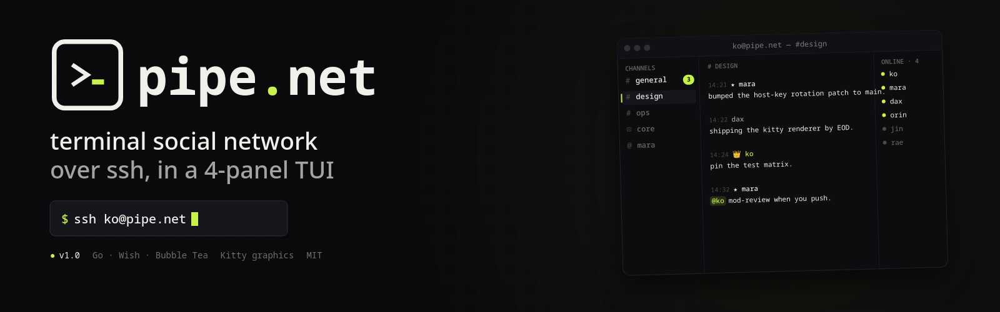
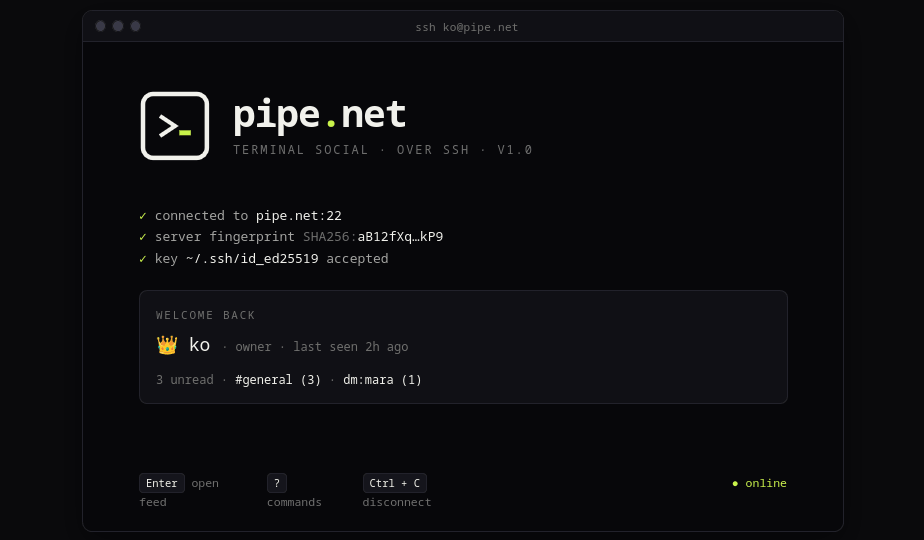
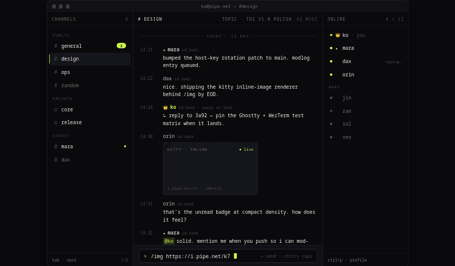
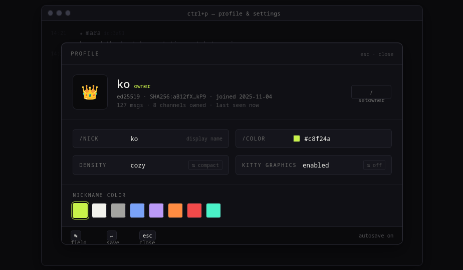
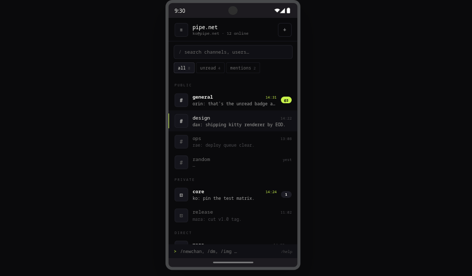
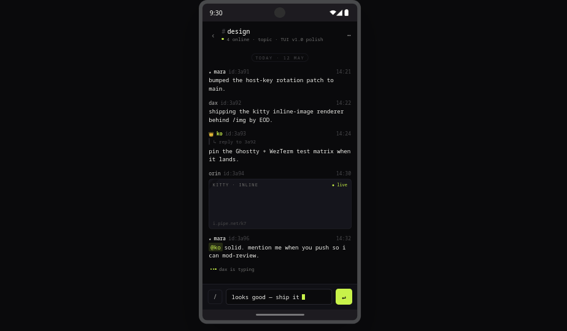
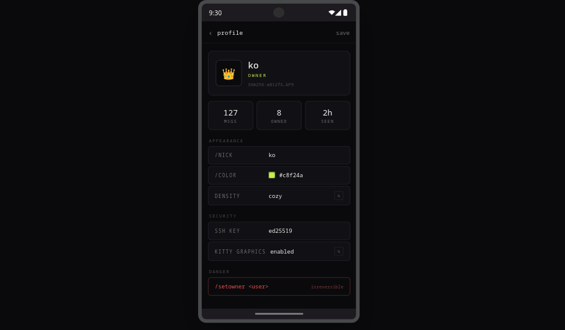

<p align="center">
  
</p>

<h1 align="center">pipe.net</h1>
<p align="center">
  <em>A terminal social network. SSH in, talk, log out.</em>
</p>

<p align="center">
  
  
  
  
</p>

---

**pipe.net** is a modern social network that lives entirely inside the terminal — and on Android. No passwords, no web UI, no signup forms. You authenticate with your SSH key, drop into a four-panel TUI, and start talking.

```
$ ssh -p 2222 you@pipe.net
```

That's it. That's the login.

---

## ✦ Highlights

- **SSH-native** — no signup, no password. Your key is your identity.
- **4-panel TUI** — channels, feed, online list, input. Modern dev-tool aesthetic.
- **Markdown + inline images** via the [Kitty Graphics Protocol](https://sw.kovidgoyal.net/kitty/graphics-protocol/) (works in Kitty, WezTerm, Ghostty).
- **Channels** — public, private, direct messages. Owner/admin/user hierarchy.
- **Native Android client** — same backend, real mobile API, PIN auth.
- **Local-first** — SQLite, your data lives next to the binary.
- **OSC 52** — `Ctrl+Y` copies the last message into your clipboard (yes, over SSH).

---

## ✦ Screens

### Terminal (TUI)

<p align="center">
  
  
</p>
<p align="center">
  
</p>

### Android

<p align="center">
  
  
  
</p>

---

## ✦ Quick start

### Server

```bash
go build -o clinet ./cmd/clinet
./clinet
```

SSH server boots on `:2222`, mobile API on `:8080`. **The first user to SSH in becomes `owner`.**

```bash
ssh -p 2222 yournick@localhost
```

### Environment

| Variable | Default | Purpose |
|---|---|---|
| `CLINET_PORT` | `2222` | SSH listen port |
| `CLINET_API_PORT` | `8080` | Mobile/HTTP API port |
| `CLINET_DB_PATH` | `clinet.db` | SQLite database file |
| `CLINET_HOST_KEY_PATH` | `.ssh/term_info_ed25519` | Host SSH key |
| `CLINET_EXPORT_DIR` | `exports` | Where `/export` writes |
| `CLINET_BACKUP_DIR` | `backups` | Where `/backup` writes |
| `CLINET_API_TLS_CERT` | — | Optional HTTPS for mobile API |
| `CLINET_API_TLS_KEY`  | — | Optional HTTPS for mobile API |

### Android

The native Compose client lives in [`android-client/`](android-client/). Build a debug APK:

```bash
cd android-client
./gradlew assembleDebug
adb install app/build/outputs/apk/debug/app-debug.apk
```

Or push to `feat/android-client` — GitHub Actions builds the APK as a workflow artifact.

Emulator endpoint: `http://10.0.2.2:8080` · Real device: `http://<LAN-IP>:8080`.

---

## ✦ Controls

| Key | Action |
|---|---|
| `Tab` | Next channel |
| `Ctrl+P` | Profile & settings |
| `Ctrl+Y` | Copy last message (OSC 52) |
| `Ctrl+C` / `Esc` | Quit |
| `↵` | Send |

---

## ✦ Commands

Available commands depend on your role (`/help` for the live list).

**Everyone**

`/nick <name>` · `/color <hex>` · `/bio <text>` · `/img <url>` · `/reply <id> <text>` · `/edit <id> <text>` · `/rm <id>` · `/search <term>` · `/older` · `/mentions` · `/members` · `/whois <user>` · `/dm <user>` · `/export [current|all]` · `/backup` · `/clear`

**Private channels**

`/invite <user>` · `/remove <user>`

**Admin+**

`/topic <text>` · `/kick <user>` · `/ban <user>` · `/unban <user>`

**Owner**

`/newchan [private] <name>` · `/delchan <name>` · `/op <user>` · `/deop <user>` · `/setowner <user>`

---

## ✦ Roles

| Glyph | Role | Powers |
|:---:|---|---|
| 👑 | `owner` | Full control — creates channels, transfers ownership, manages admins |
| ★ | `admin` | Moderation — kick/ban/unban, edit channel topic |
| · | `user` | Talk, DM, customize nick & color |

---

## ✦ Stack

- **Go** — [Wish](https://github.com/charmbracelet/wish), [Bubble Tea](https://github.com/charmbracelet/bubbletea), [Lip Gloss](https://github.com/charmbracelet/lipgloss), [Glamour](https://github.com/charmbracelet/glamour)
- **Android** — Kotlin, Jetpack Compose, Material 3
- **Storage** — SQLite
- **Graphics** — Kitty Graphics Protocol for inline images

---

## ✦ Design

Monochrome dark canvas with a single acid-lime accent (`#c8f24a`). No gradients, no glow, no CRT effects — just type and surface hierarchy. Design tokens are the single source of truth:

- Go: [`internal/design/design.go`](internal/design/design.go)
- Android Compose: [`android-client/app/src/main/java/net/pipe/mobile/ui/theme/PipeTheme.kt`](android-client/app/src/main/java/net/pipe/mobile/ui/theme/PipeTheme.kt)

<p align="center">
  
</p>

---

## ✦ Security

- Auth via **SSH public keys** — no passwords on the wire for the TUI.
- Mobile clients use a **PIN** set via `/setpin` in the SSH session.
- Owner account is protected from kick/ban/demote operations.
- Optional **TLS** for the mobile API via `CLINET_API_TLS_CERT` / `_KEY`.
- DB, logs, and host keys are ignored by git by default.

See [SECURITY.md](SECURITY.md) for the disclosure policy.

---

## ✦ License

MIT — see [LICENSE](LICENSE).
